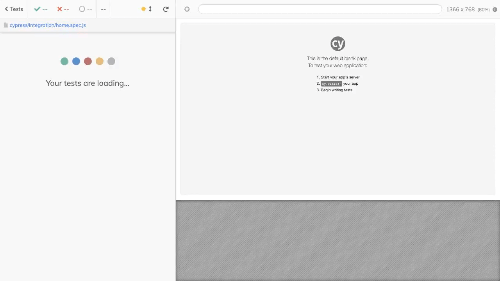
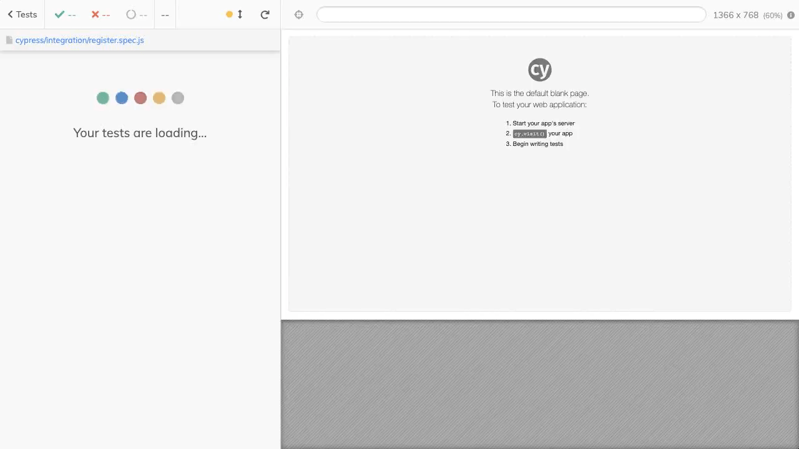

<h1>cypress-discovery</h1>

Desenvolvido durante o curso Cypress Discovery promovido pela plataforma https://app.qaninja.com.br/ sob orientação do Coordenador Papito Fernando.

 <h3>Execução do testes criados no projeto</h3>

  
  

 <h3>Ferramentas e tecnologias ultilizadas</h3>

  
  

 <h3>Cenários implementados no projeto</h3>

- Verificar aplicação online
- Verificar cadastro com sucesso
- Verificar cadastro com CPF inválido
- Verificar cadastro com Email inválido
- Verificar alerta de campos obrigatórios

 <h3>Checklist do Projeto</h3>

✅ Criar o projeto ultilizando o Cypress na versão mais recente

✅ Desenvolver/ Implementar testes

✅ Subir projeto no Github

✅ Configure as actions para executar os testes

✅ Configure dashboard Cypress para ter histórico de execução dos testes

 <h3>🎓 Certificado 🎓</h3>

